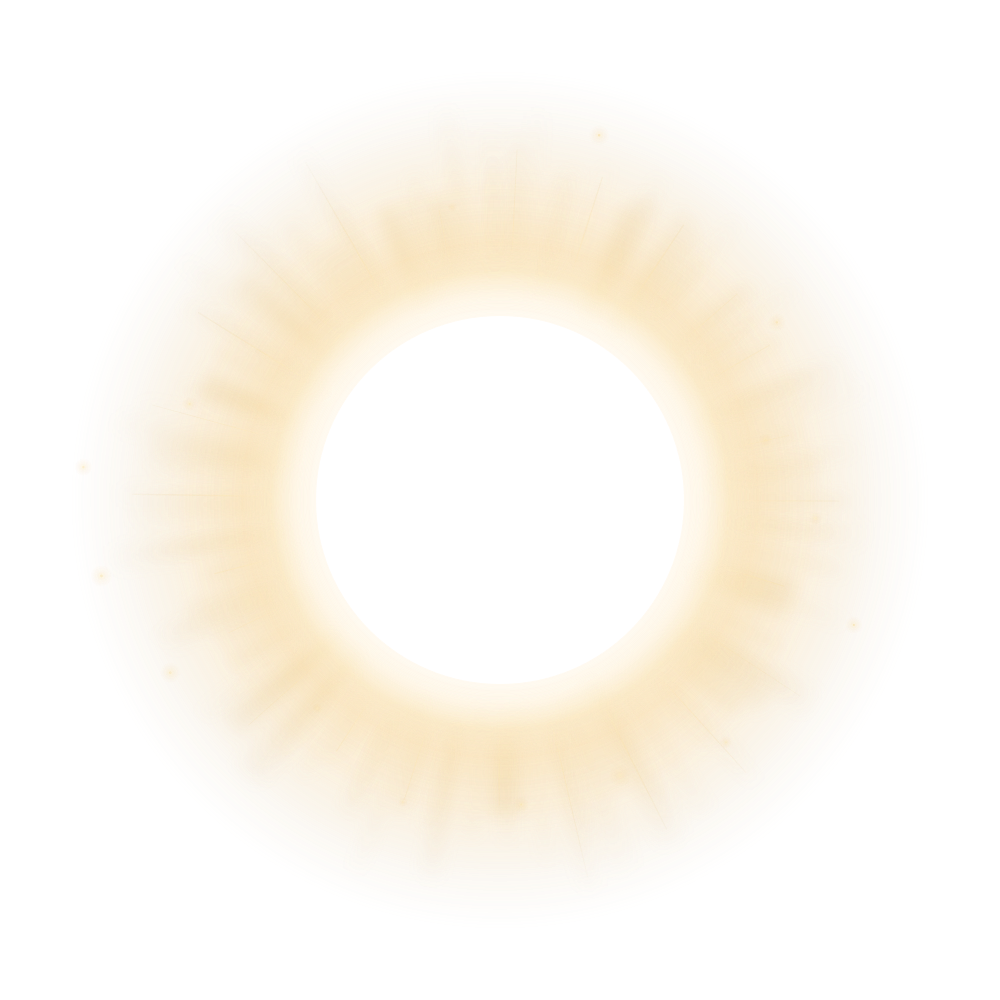
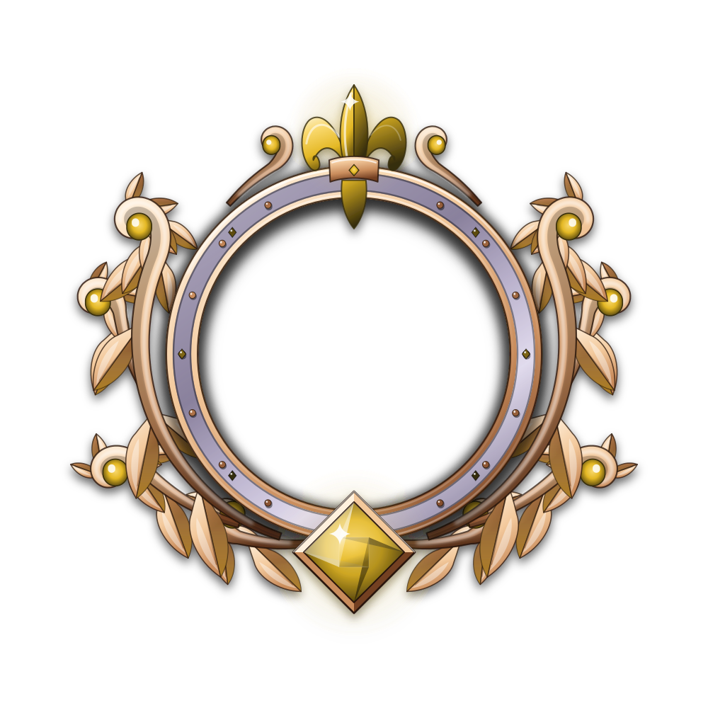

# Titelschein · Korona, Halo, Aurora

Die Titel erzeugen in diesem Entwurf **einen Lichtschein hinter Avatar und Insignium**. Die drei Lichtformen haben jeweils zehn Stufen. Gold bleibt die Titelfarbe; das vorhandene Insignium und seine Rangsteine behalten ihre Darstellung.

`index.html` direkt im Browser öffnen. Die große Ansicht ist animiert; die Zehnerleiter und die drei Vergleichskarten sind statisch. „Nur Licht“ blendet Avatar und Insignium in der Hauptansicht aus. „Bewegung“ pausiert die Animation. Die Systemeinstellung für reduzierte Bewegung wird automatisch berücksichtigt.

## Die drei Lichtformen

- **Korona:** weicher Goldschein, ungleich lange Lichtstrahlen und später feine Goldpartikel.
- **Halo:** diffuser Lichthof mit offenen, langsam kreisenden Lichtbögen.
- **Aurora:** durchscheinende Lichtschleier, die sich langsam gegeneinander bewegen.

Jede weitere Stufe verstärkt das Licht und erweitert seine Struktur. Stufe 1 beginnt mit einem sichtbaren Hintergrundschein; hohe Stufen ergänzen zweite Tiefenebenen, einzelne Reflexe und einen langsamen Lichtimpuls. Kein Teil des Insigniums dreht sich mit.

## Dateien

- `assets/{korona,halo,aurora}/aura-01.svg` bis `aura-10.svg`: 30 transparente, eigenständige **statische** SVGs.
- `aura-design.js`: kleine, unabhängige Zeichenkomponente für dieselben SVGs als Inline-Markup; enthält weder Ligadaten noch Titelberechnung.
- `aura.css`: wiederverwendbare Ebenen und opt-in Animationen für die Inline-SVGs.
- `manifest.json`: Namen, Beschreibungen und Dateipfade der 30 Entwürfe.
- `insignien/`: fünf unveränderte Vorschaukopien der vorhandenen Insignien.
- `preview.js` und `preview.css`: Bedienung und Layout dieser eigenständigen Designseite.
- `build-assets.cjs`: erzeugt die SVG-Dateien aus `aura-design.js` (`node build-assets.cjs`). Im Repository werden die Vorschau-Reife aus `schwingen-svg/insignien` kopiert; im entpackten Paket bleiben die mitgelieferten Vorschau-Reife erhalten.
- `vorschau.png`: statischer Vergleich der drei Lichtformen bei zehn Titeln. Für die Effekte `index.html` öffnen.

SVG ist frei skalierbar. Die Zeichenfläche beträgt `1000 × 1000`, Mittelpunkt `(500,500)`. Es gibt keine Rasterbilder, externen Bildquellen oder Fonts in den Licht-SVGs.

## Statisch einbauen

Beispiel für eine HTML-Datei in diesem Ordner:

```html
<link rel="stylesheet" href="aura.css">

<div class="ta-emblem" style="--ta-size:350px" role="img"
     aria-label="Leon, Zierkranz mit Korona für sechs Titel">
  <div class="ta-aura" aria-hidden="true">
    
  </div>
  <div class="ta-avatar" aria-hidden="true"><span>LM</span></div>
  
</div>
```

Der Schein liegt auf Ebene 0, der deckende Avatar auf Ebene 1, das Insignium auf Ebene 2. Das Insignium sitzt bei `left:15%; top:15%; width:70%; height:70%`. Sein ursprünglicher Innenradius von 220 wird dadurch 154. Der Avatar hat entsprechend **30,8 % der Gesamtbreite**: bei 350 px Lichtfläche rund 108 px. Das Beispiel benötigt daher deutlich weniger seitlichen Platz als der vorherige Flügelentwurf.

Für ein Foto den Avatar-Container durch ein Bild mit `class="ta-avatar"` ersetzen. Der Avatar muss deckend bleiben. Ein zentraler Ausschnitt mit **Radius 184 SVG-Einheiten** ist zusätzlich transparent ausgespart, damit der Lichtschein nicht durch die Mitte fällt.

## Animiert einbauen

Für die Bewegung das SVG **inline** in die hinterste Ebene setzen. CSS außerhalb eines mit `` eingebetteten SVGs kann dessen interne Gruppen nicht animieren.

```html
<script src="aura-design.js"></script>
<div class="ta-emblem ta-animated" style="--ta-size:350px"
     role="img" aria-label="Leon, animierte Korona für sechs Titel">
  <div class="ta-aura" id="leonsAura" aria-hidden="true"></div>
  <div class="ta-avatar" aria-hidden="true"><span>LM</span></div>
  
</div>
<script>
  document.getElementById('leonsAura').innerHTML =
    TitleAura.render('korona', 6, {prefix: 'profil-leon-korona-6'});
</script>
```

`prefix` muss pro gleichzeitig angezeigter Inline-Instanz eindeutig sein, damit sich Masken und Verläufe nicht vermischen. Bei mehreren ``-Instanzen ist das nicht erforderlich.

Die Klasse `ta-animated` aktiviert ruhige Opazitäts- und Transformationsanimationen. `ta-still` pausiert sie. Bei `prefers-reduced-motion: reduce` bleiben alle Gruppen statisch. Die Filter selbst werden nicht animiert. Für Listen und die vollständige Stufenübersicht statische SVG-Bilder verwenden; die Animation ist für eine hervorgehobene Profilansicht gedacht.

## Anschluss an die App

Dieses Paket ändert weder Daten noch produktiven Code. Die Titelstufe wird hier ausdrücklich als Darstellungsparameter übergeben. Die App verwendet derzeit andere Freischaltschwellen; die Umstellung auf zehn Stufen ist eine spätere Produktentscheidung. Die Zeichenfunktion begrenzt ihren Parameter auf 1–10 und bestimmt selbst **nicht**, ob ein Spieler bereits einen Titel hat: bei 0 Titeln gar keine Aura einfügen.

Für die dynamische Rangfarbe und den tatsächlichen Insigniengrad weiterhin den vorhandenen Insignienrenderer verwenden. Die mitgelieferten Reife sind nur feste Vergleichsstände. Den Hintergrundschein außerhalb enger Avatar-Clips platzieren, die gesamte quadratische Lichtfläche reservieren und vorhandenes Ranglicht bzw. Serienfeuer beim späteren Zusammenführen bewusst abstimmen. Die neue Titelaura ist warmes, langsam bewegtes Licht und keine Flamme.
